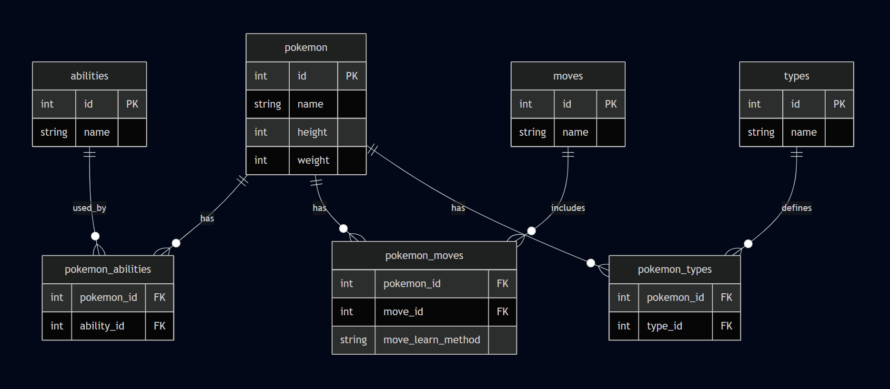

# Pokemon API Data Pipeline

This project was created by Callum Bain for Sparta Global. Its goal is to build a complete data pipeline that extracts data from the [PokeAPI](https://pokeapi.co/), cleans, transforms and loads it into a SQL Server database using SQLAlchemy.

It demonstrates ETL (Extract, Transform, Load) principles, database normalisation and integration of REST APIs into data pipelines.

---

## Database Schema (ERD)

The relational database consists of a core pokemon table and three main tables: types, abilities and moves. Each of these main tables are connected to pokemon through junction tables.

Below is the ERD that illustrates this schema:



---

## Getting Started

These instructions will help you get a copy of the project up and running on your local machine.

---

### Prerequisites

Before running the project, make sure you have:

* **Python 3.10+**
* **SQL Server LocalDB** (or another SQL Server instance)
* **ODBC Driver 17+ for SQL Server**
* A working `requirements.txt` with the following (or similar) Python packages:
  - `pandas`
  - `requests`
  - `sqlalchemy`
  - `sqlalchemy-utils`
  - `pyodbc`

### Installation

Step-by-step guide to set up the development environment:

```bash
# 1. Clone the repository
git clone https://github.com/Callum-Bain/sparta_pokemon.git
cd sparta_pokemon

# 2. Create a virtual environment
python -m venv venv
source venv/bin/activate     # On Windows: venv\Scripts\activate

# 3. Install dependencies from requirements.txt
pip install -r requirements.txt

# 4. Run the main script
pokemon.py
```

---

## Project Structure

```bash
sparta_pokemon/
├── pokemon.py # Main ETL script (run this)
├── requirements.txt # Python dependencies
├── pokemon_erd.png # Entity Relationship Diagram
├── README.md # Project documentation
```

---

## Example Output

When you run `pokemon.py`, it will print messages like the following:

```bash
All Tables Created
Pokemon Table Populated
Type and Junction Tables Populated
Ability and Junction Tables Populated
Move and Junction Tables Populated

Sample of Pokemon Table Query:
[id, name, height, weight]
(1, 'bulbasaur', 7, 69)
...
```

---

## License

This project is licensed under the [MIT License](LICENSE).
 
